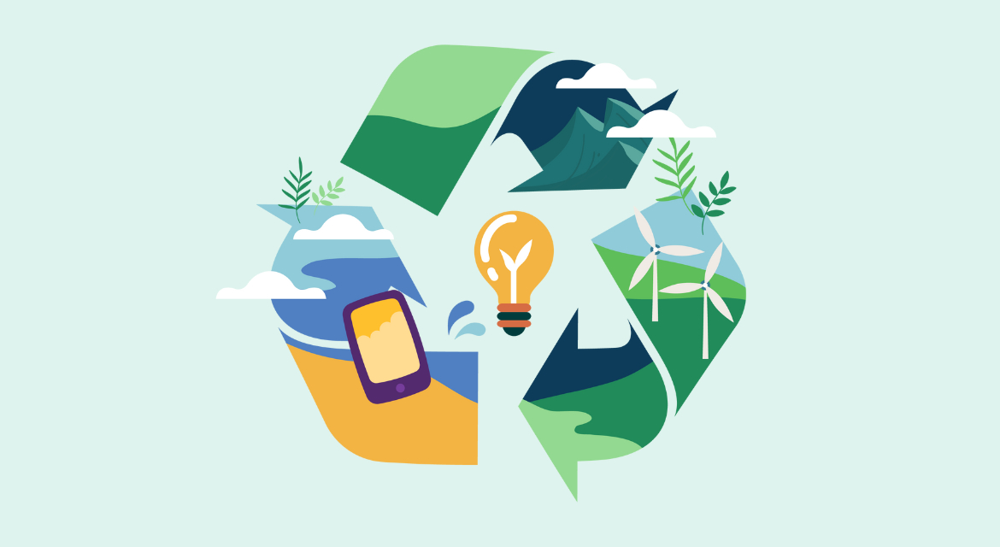
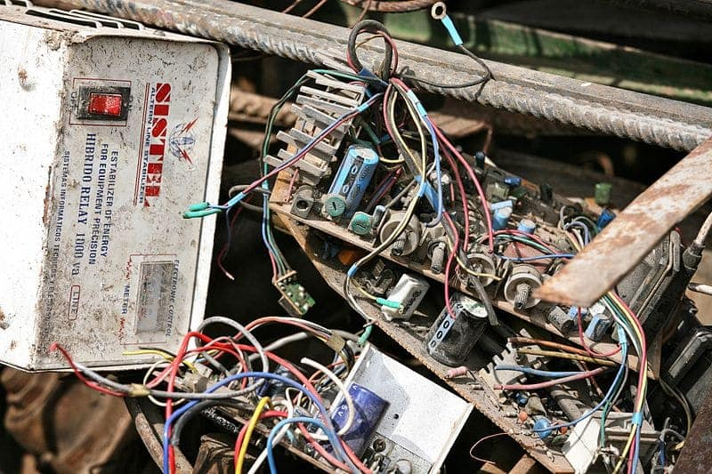
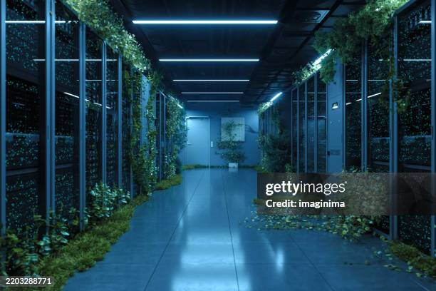

# informática-ambiental

🌍 Gestión de Sostenibilidad en Sistemas TI: Proyecto Informática Ambiental

Este repositorio contiene el análisis técnico sobre el impacto ambiental derivado de la infraestructura de sistemas, la gestión de residuos electrónicos y las estrategias de Green IT aplicables en entornos corporativos.

📋 Índice
1.El Impacto Ambiental de la Digitalización

2.Gestión de Residuos Informáticos (RAEE)

3.Obsolescencia: Programada vs. Tecnológica

4.Green Computing y Datacenters Sostenibles

5.Características Avanzadas de Markdown

1. El Impacto Ambiental de la Digitalización

Como futuros administradores, debemos entender que la "nube" tiene un soporte físico. La contaminación ambiental en IT no solo es química, sino energética.

    Emisiones de CO2: Se estima que el sector TIC es responsable de un porcentaje del PIB mundial de emisiones similar al de la industria de la aviación.

    Extracción de tierras raras: La fabricación de semiconductores requiere materiales como el coltán o el litio, cuya extracción tiene un alto coste ecológico y social.

   

2. Gestión de Residuos Informáticos (RAEE)

Los RAEE (Residuos de Aparatos Eléctricos y Electrónicos) representan un desafío crítico en el mantenimiento de sistemas.

    Componentes peligrosos: Plomo en soldaduras, mercurio en pantallas antiguas y retardantes de llama bromados en placas base.

    Logística Inversa: Importancia de los puntos de recogida y empresas certificadas para el tratamiento de componentes de red y servidores fuera de uso.

3. Obsolescencia: Programada vs. Tecnológica

En ASIR, diferenciamos dos conceptos que llenan nuestros almacenes de hardware:

    Obsolescencia Programada: Limitación deliberada de la vida útil de un dispositivo por parte del fabricante (ej. baterías no reemplazables o chips de conteo en impresoras).

    Obsolescencia Tecnológica: Cuando el hardware ya no soporta los requisitos de los sistemas operativos modernos o carece de parches de seguridad (ej. falta de soporte para TPM 2.0 en CPUs antiguas).

4. Green Computing y Datacenters Sostenibles

La Informática Ecológica es nuestra principal herramienta de mitigación. Aplicamos técnicas como:

    Virtualización (Consolidación de Servidores): Pasar de 10 servidores físicos infrautilizados a 1 servidor físico robusto con 10 máquinas virtuales (VMs) reduce el consumo eléctrico y la huella de calor.

    Optimización del PUE (Power Usage Effectiveness): Ratio que mide la eficiencia energética de un CPD.

    Free Cooling: Uso del aire exterior para refrigerar racks, reduciendo el gasto en aire acondicionado industrial.

🚀 5. Características Avanzadas de Markdown

1. Alertas de GitHub (Admonitions)

Sirven para resaltar avisos importantes con iconos de colores.
2. Listas de Tareas (Checklists)

Ideales para mostrar procesos o fases del proyecto.
3. Menús Desplegables (HTML Tags)

Para ocultar información secundaria y que el Readme no sea eterno.

4. Anclas (Enlaces internos)

Para que al pulsar en el índice, la página baje sola a esa sección.

Informatica ecologica

Dato para el Administrador: Activar los estados de ahorro de energía en la BIOS/UEFI de los servidores puede reducir el consumo en reposo hasta un 15%.

## 📚 Referencias y Fuentes de Información

Para el desarrollo de este proyecto se han consultado las siguientes fuentes técnicas y oficiales:

*   [Directiva 2012/19/UE (RAEE)](https://www.boe.es/buscar/doc.php?id=DOUE-L-2012-81423): Normativa europea oficial sobre el tratamiento de residuos de aparatos eléctricos y electrónicos.
*   [Informe Global E-waste Monitor](https://www.itu.int/en/ITU-D/Environment/Pages/Spotlight/Global-E-waste-Monitor-2024.aspx): Datos estadísticos actualizados sobre la generación de basura electrónica a nivel mundial.
*   [Guía de Green IT (U.S. Department of Energy)](https://www.energy.gov/eere/femp/energy-efficient-data-centers): Mejores prácticas para la eficiencia energética en Centros de Procesamiento de Datos (CPD).
*   [Fundación Feniss](https://feniss.org/): Organización especializada en la lucha contra la obsolescencia programada y la promoción del sello ISSOP.
*   [Greenpeace - Guía de Electrónica Verde](https://www.greenpeace.org/international/act/greener-electronics/): Ranking de fabricantes según su compromiso con el medio ambiente y el uso de materiales no tóxicos.

👥 Autores

      Hugo Izquierdo Romero - Proteccion Ambiental

      Diego Lopez - Seguridad en el trabajo
